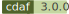

# Continuous Delivery Automation Framework for Windows

For published documentation see https://docs.cdaf.io/

For core product see automation directory and see also samples directory for some patterns.

